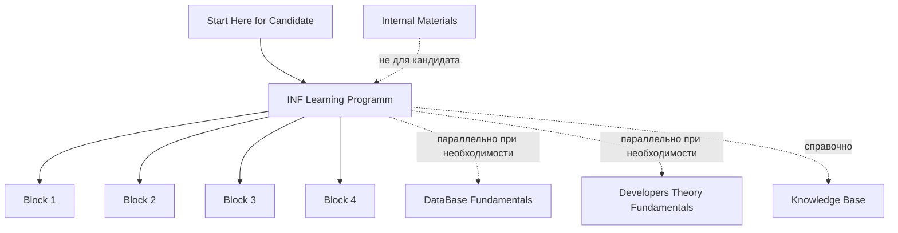

# INF Jira Learning Program

Репозиторий содержит учебную программу по `Jira Service Management Cloud`, а также вспомогательные теоретические треки для подготовки кандидатов, стажеров и джунов.

## Candidate Start

Если вы кандидат, стажер или джун и вам нужно понять, с чего начать:
- откройте [Start Here for Candidate.md](Start%20Here%20for%20Candidate.md)

## Карта прохождения

## Нажимаемая карта блоков

### Старт

- [Start Here for Candidate.md](Start%20Here%20for%20Candidate.md) — единая стартовая точка для кандидата.
- [INF Learning Programm/README.md](INF%20Learning%20Programm/README.md) — основной маршрут программы.

### Основной трек: INF Learning Programm

#### Блок 1. Создание среды и базовые процессы

- [01_Setup_Atlassian_Cloud.md](INF%20Learning%20Programm/01_Setup_Atlassian_Cloud.md)
- [02_Service_Catalog_Practice.md](INF%20Learning%20Programm/02_Service_Catalog_Practice.md)
- [03_Incident_Management_Practice.md](INF%20Learning%20Programm/03_Incident_Management_Practice.md)
- [04_Service_Request_Practice.md](INF%20Learning%20Programm/04_Service_Request_Practice.md)
- [05_Block_1_SLA_and_Queues_Practice.md](INF%20Learning%20Programm/05_Block_1_SLA_and_Queues_Practice.md)
- [06_Block_1_Final_Workshop.md](INF%20Learning%20Programm/06_Block_1_Final_Workshop.md)

#### Блок 2. Тестовые данные CMDB

- [07_CMDB_Test_Data_Practice.md](INF%20Learning%20Programm/07_CMDB_Test_Data_Practice.md)
- [CMDB_Test_Data_Reference.md](INF%20Learning%20Programm/CMDB_Test_Data_Reference.md)
- [07_Block_2_Final_Workshop.md](INF%20Learning%20Programm/07_Block_2_Final_Workshop.md)

#### Блок 3. CMDB и расширенные ITSM-процессы

- [08_CMDB_Data_Modeling_Practice.md](INF%20Learning%20Programm/08_CMDB_Data_Modeling_Practice.md)
- [09_CMDB_PostgreSQL_pgAdmin_Practice.md](INF%20Learning%20Programm/09_CMDB_PostgreSQL_pgAdmin_Practice.md)
- [10_Major_Incident_Practice.md](INF%20Learning%20Programm/10_Major_Incident_Practice.md)
- [11_Problem_Management_Practice.md](INF%20Learning%20Programm/11_Problem_Management_Practice.md)
- [12_Change_Management_Practice.md](INF%20Learning%20Programm/12_Change_Management_Practice.md)
- [13_Block_3_SLA_and_Queues_Practice.md](INF%20Learning%20Programm/13_Block_3_SLA_and_Queues_Practice.md)
- [14_Block_3_Final_Workshop.md](INF%20Learning%20Programm/14_Block_3_Final_Workshop.md)

#### Блок 4. Аналитика и проектирование интеграций

- [15_Availability_Management_Practice.md](INF%20Learning%20Programm/15_Availability_Management_Practice.md)
- [16_Integration_Model_Design_Practice.md](INF%20Learning%20Programm/16_Integration_Model_Design_Practice.md)
- [17_Block_4_SLA_and_Queues_Practice.md](INF%20Learning%20Programm/17_Block_4_SLA_and_Queues_Practice.md)
- [18_Block_4_Final_Workshop.md](INF%20Learning%20Programm/18_Block_4_Final_Workshop.md)

### Параллельные треки

- [DataBase Fundamentals/README.md](DataBase%20Fundamentals/README.md) — параллельный трек по РБД, SQL и PostgreSQL.
- [Developers Theory Fundamentals/README.md](Developers%20Theory%20Fundamentals/README.md) — параллельный трек по базовой теории для разработчика.
- [Knowledge Base/README.md](Knowledge%20Base/README.md) — справочные материалы, словари и внешние ресурсы.

## Главный маршрут

Основной трек репозитория:
- [INF Learning Programm](INF%20Learning%20Programm/README.md) — главная учебная программа с последовательными блоками практических заданий.

Именно этот трек является основным маршрутом прохождения программы.

## Параллельные треки

Эти треки идут как поддерживающие и могут изучаться параллельно с основной программой:
- [DataBase Fundamentals](DataBase%20Fundamentals/README.md) — отдельный трек по базовым знаниям о реляционных БД, SQL и PostgreSQL;
- [Developers Theory Fundamentals](Developers%20Theory%20Fundamentals/README.md) — отдельный трек по базовым понятиям для разработчика: клиент-серверная архитектура, HTTP и DOM.

Их задача:
- закрыть пробелы в базе;
- снизить риск того, что участник "падает" не на логике заданий, а на отсутствии фундаментальных знаний;
- дать общий технический язык для дальнейшей работы.

## Дополнительные candidate-facing материалы

- [Knowledge Base](Knowledge%20Base/README.md) — теоретическая база с внешними ресурсами и словарями терминов по уровням `базовый` и `продвинутый`;
- [DataBase Fundamentals](DataBase%20Fundamentals/README.md) — параллельный трек по базам данных;
- [Developers Theory Fundamentals](Developers%20Theory%20Fundamentals/README.md) — параллельный трек по базовой теории для разработчика.

## Что использовать

Если нужен учебный трек:
- начните с [INF Learning Programm/README.md](INF%20Learning%20Programm/README.md)

Если нужно подтянуть именно основы баз данных:
- начните с [DataBase Fundamentals/README.md](DataBase%20Fundamentals/README.md)

Если нужно подтянуть базовые понятия веб-разработки:
- начните с [Developers Theory Fundamentals/README.md](Developers%20Theory%20Fundamentals/README.md)

Если нужна теоретическая подготовка кандидата:
- начните с [Knowledge Base/README.md](Knowledge%20Base/README.md)

## Структура репозитория

- `INF Learning Programm/` — основной практический трек
- `DataBase Fundamentals/` — параллельный трек по базам данных
- `Developers Theory Fundamentals/` — параллельный трек по базовой теории для разработчика
- `Knowledge Base/` — дополнительная теоретическая база и словари
- `Internal Materials/` — внутренние материалы для лидов, экзаменаторов и методической работы

## Рекомендуемый порядок

1. Начать с [INF Learning Programm/README.md](INF%20Learning%20Programm/README.md) как с главного маршрута.
2. При необходимости параллельно использовать [DataBase Fundamentals/README.md](DataBase%20Fundamentals/README.md), если не хватает базы по SQL и PostgreSQL.
3. При необходимости параллельно использовать [Developers Theory Fundamentals/README.md](Developers%20Theory%20Fundamentals/README.md), если не хватает базы по клиент-серверной архитектуре, HTTP и DOM.
4. Использовать [Knowledge Base/README.md](Knowledge%20Base/README.md) как дополнительный справочный слой.

## Внутренний контур

Если нужны материалы для лида, экзаменатора или внутренней методической работы:
- используйте [Internal Materials/README.md](Internal%20Materials/README.md)

## Важные правила

- целевая платформа программы: `Jira Service Management Cloud`
- `Assets` и trial-функции не используются в основной версии заданий
- для моделирования систем в Jira используются `Components`
- для части `CMDB` используется абстрактная модель данных и локальный `PostgreSQL`

## Быстрый маршрут

1. Откройте [INF Learning Programm/README.md](INF%20Learning%20Programm/README.md) — это основной трек.
2. Откройте [DataBase Fundamentals/README.md](DataBase%20Fundamentals/README.md), если параллельно нужно подтянуть базы данных.
3. Откройте [Developers Theory Fundamentals/README.md](Developers%20Theory%20Fundamentals/README.md), если параллельно нужно подтянуть базовую теорию для разработчика.
4. Откройте [Knowledge Base/README.md](Knowledge%20Base/README.md), если нужен дополнительный слой теории и внешних ресурсов.
5. Если вы не кандидат, а экзаменатор или лид, откройте [Internal Materials/README.md](Internal%20Materials/README.md).
