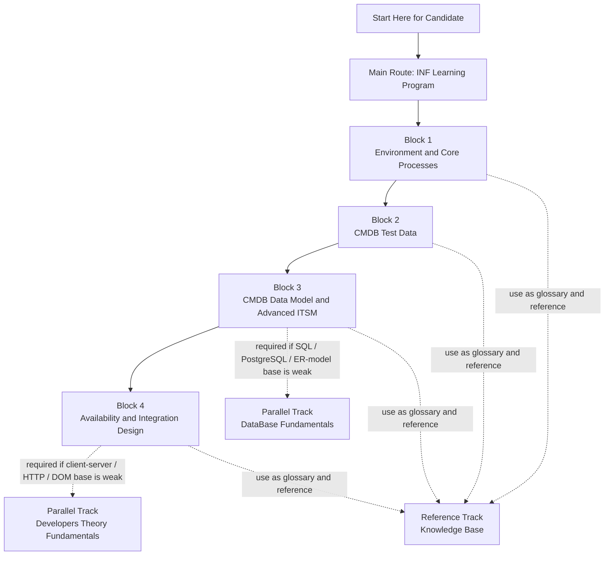

# Start Here for Candidate

Этот файл — стартовая точка для кандидата, стажера или джуна.

Если вам выдали этот репозиторий для прохождения программы, начинайте отсюда.

## Полная карта прохождения

Если ваш просмотрщик Markdown не делает узлы диаграммы кликабельными, используйте ссылки ниже.

## Нажимаемая карта маршрута

### Основной маршрут

- [INF Learning Program/README.md](INF%20Learning%20Program/README.md) — главный маршрут программы.
- [Block 1](INF%20Learning%20Program/Block%201/01_Setup_Atlassian_Cloud.md) — создание среды и базовые процессы.
- [Block 2](INF%20Learning%20Program/Block%202/07_CMDB_Test_Data_Practice.md) — тестовые данные CMDB.
- [Block 3](INF%20Learning%20Program/Block%203/08_CMDB_Data_Modeling_Practice.md) — модель данных CMDB, PostgreSQL и расширенные ITSM-процессы.
- [Block 4](INF%20Learning%20Program/Block%204/15_Availability_Management_Practice.md) — доступность и проектирование интеграций.

### Параллельные треки

- [DataBase Fundamentals/README.md](DataBase%20Fundamentals/README.md) — открывайте перед блоком 3, если не хватает базы по РБД, SQL, `JOIN`, подзапросам, `PostgreSQL` и `pgAdmin`.
- [Developers Theory Fundamentals/README.md](Developers%20Theory%20Fundamentals/README.md) — открывайте перед блоком 4, если не хватает базы по клиент-серверной архитектуре, `HTTP`, `HTML` и `DOM`.
- [Knowledge Base/README.md](Knowledge%20Base/README.md) — используйте по ходу всей программы как словарь и справочный слой.

## Что является основным маршрутом

Основной трек:
- [INF Learning Program/README.md](INF%20Learning%20Program/README.md)

Именно этот трек нужно проходить как главный.

## Рекомендуемый порядок

1. Откройте [INF Learning Program/README.md](INF%20Learning%20Program/README.md).
2. Идите по блокам строго по порядку.
3. Если на каком-то этапе не хватает базы по данным, откройте [DataBase Fundamentals/README.md](DataBase%20Fundamentals/README.md).
4. Если не хватает базовой веб-теории, откройте [Developers Theory Fundamentals/README.md](Developers%20Theory%20Fundamentals/README.md).
5. Если нужен дополнительный словарь и внешние ссылки, используйте [Knowledge Base/README.md](Knowledge%20Base/README.md).

## Что не является стартовой точкой для кандидата

На старте не нужно ориентироваться на внутренние материалы.

Их можно игнорировать, если вам отдельно не сказали обратное:
- `Internal Materials/`

## Коротко

Если нужно выбрать один файл для старта:
- начните с [INF Learning Program/README.md](INF%20Learning%20Program/README.md)
